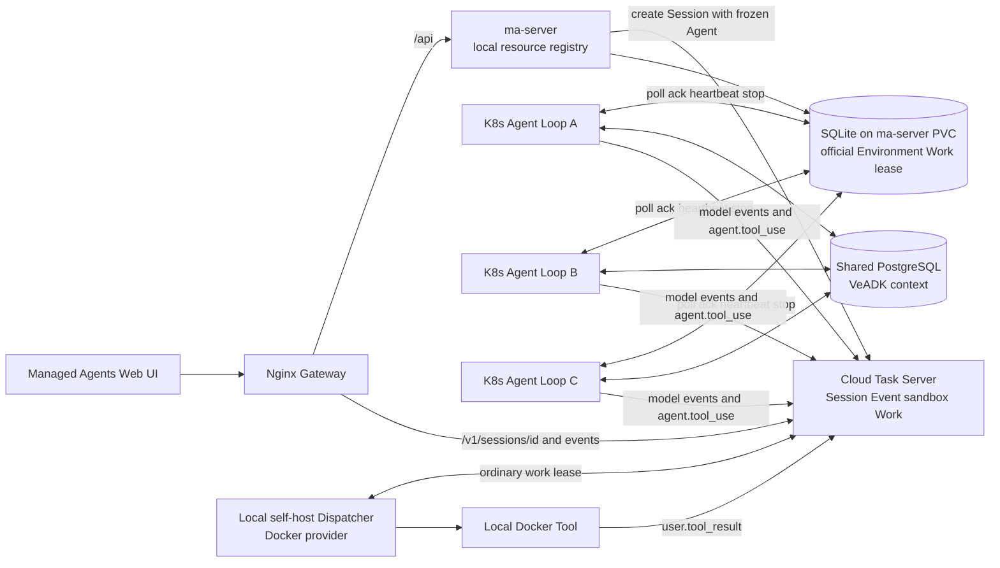
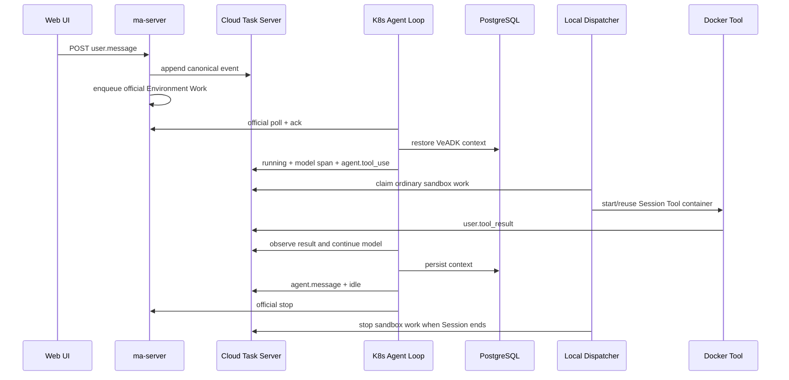

# Managed Agents：三副本 Agent Loop、云端 Task Server 与本地 Docker Tool

本文记录截至 2026-09-06 已实现并完成真实验证的最终方案。当前运行路径只有一套：

- Agent、Environment 和 Session 列表索引由本地 `ma-server` 管理；
- Session、canonical Event 和 sandbox Tool Work 由云端 Task Server 管理；
- `ma-server` 为本地 Environment ID 提供官方 `/v1/environments/{id}/work/*`
  控制面，三个 K8s VeADK Agent Loop 副本通过官方 SDK 平等竞争；
- `/home/mofanke/gitcode/actb-mono/sandboxes/self-host-sandbox` 使用 local Docker
  provider 领取云端普通 work，只负责执行 tool call；
- VeADK 对话上下文写入共享 PostgreSQL，任意 Agent Loop 副本都能恢复下一轮。

早期自建 Task Server、AgentKit Environment provisioning 和“模型 Worker 直接执行
Bash”的实验不属于当前部署，详见文末历史说明。

## 1. 目标和最终结论

本方案解决四个问题：

1. 多个 Agent Loop 如何平等领取工作且不重复消费；
2. Agent Loop 更换 Pod 后如何恢复同一 Session 的上下文；
3. 如何保证模型循环在 K8s，而 Bash 等工具只在本地 self-host-sandbox 中执行；
4. 如何在同一个 Web 页面创建 Agent、Environment、Session 并完成多轮对话。

最终结论是使用两个相互隔离、但协议相同的官方 Environment Work 控制面：

| work | 存储与租约 | 消费者 | 职责 |
| --- | --- | --- | --- |
| Agent Loop Work | `ma-server` SQLite/PVC，官方 `/v1/environments/{id}/work/*` | 3 个 K8s VeADK Agent Loop Pod | 模型调用、上下文恢复、发布工具请求和最终消息 |
| sandbox Tool Work | 云端 Task Server 数据库，同一官方 Work API | local self-host-sandbox Dispatcher/Tool | 监听 `agent.tool_use`、执行工具、回写结果 |

二者使用不同 base URL，不能由同一组 Worker 混合消费。Worker 端只依赖官方 SDK，
不存在项目私有的 poll/ack/heartbeat/stop 协议。

## 2. 整体架构



### 2.1 组件边界

| 组件 | 负责 | 不负责 |
| --- | --- | --- |
| 云端 Task Server | Session、canonical Event、普通 sandbox Work；普通 work 的数据库行锁和租约 | 本地 Agent/Environment CRUD、模型执行 |
| `ma-server` | 本地 Agent/Environment、Session 索引、冻结 Agent 快照、官方 Environment Work API、AgentKit Skills API 适配 | canonical Event 存储、sandbox Tool Work、Skills 状态存储 |
| Nginx Gateway | 静态前端、同源 API 分流、云端鉴权注入、内部队列路由隔离 | 业务状态 |
| K8s Agent Loop | 读取冻结 Agent、调用模型、维护事件和 VeADK 上下文 | 在 Pod 内执行 Bash/文件工具 |
| local self-host-sandbox | poll 普通 work、启动 Docker Tool、回写 tool result | 模型推理、Agent Loop |
| PostgreSQL | VeADK/Google ADK Session 与 Event 上下文 | 云端 Task Server 数据 |

## 3. 资源和状态归属

### 3.1 Agent

Agent 由 `ma-server/ma_server/agent_store.py` 保存为本地 JSON registry，支持
create/list/retrieve/update/archive 和版本检查。创建 Session 时，`ma-server` 将 Agent ID
展开成 `agent_with_overrides`：

```json
{
  "type": "agent_with_overrides",
  "id": "agent_xxx",
  "version": 1,
  "model": {"id": "model_xxx"},
  "system": "...",
  "tools": [],
  "mcp_servers": [],
  "skills": []
}
```

云端 Task Server 将该对象冻结在 Session 中。因此 Agent 后续更新不会改变已有 Session。

AgentKit 是 Skills 的唯一状态源。ma-server 的 Skills API 每次都直接调用 AgentKit
`2025-10-30` 的 create/list/get/update/version/download/delete 接口，不使用 Skills
SQLite、本地 cache 或删除 tombstone。Session 只冻结 `skill_id + version` 引用；如果
Agent 使用 `latest`，创建 Session 时先解析并改写为具体版本。AgentKit 没有单版本删除
接口，因此对应 Managed Agents 路由明确返回 501，不用本地状态伪造删除。

### 3.2 Environment

Environment 由 `ma-server/ma_server/local_store.py` 在本地生成 `env_...` ID。云端不做
Environment CRUD 或 ID 校验；这个 ID 只需在以下位置保持一致：

- 本地 Environment registry；
- 创建云端 Session 时的 `environment_id`；
- local self-host-sandbox 的 `ENVIRONMENT_ID_OVERRIDE`；
- 云端普通 work 的路由键。

当前 Environment 创建不调用 AgentKit API。页面会为选中的 Environment 生成 local Docker
Dispatcher 启动命令。

### 3.3 Session 和 Event

Session 实体和 canonical Event 都在云端 Task Server。由于云端接口当前没有
Agent/Environment CRUD 和 Session 列表，`ma-server` 额外保存一个轻量 Session 索引供页面
展示；Session 当前状态和消息内容仍以云端回读为准。

写入 `user.message` 的顺序是：

1. 浏览器调用 `POST /api/sessions/{id}/events`；
2. `ma-server` 先将事件写入云端 Task Server；
3. 云端写入成功后，`ma-server` 为本地 Environment enqueue 官方 Work；
4. K8s Agent Loop 通过官方 SDK 领取 work 并处理一个未闭合的 `user.message`。

这样不会出现“模型已开始运行，但用户消息没有进入 canonical ledger”的状态。

## 4. 双 Work 调度与不重复消费

### 4.1 本地 Environment 的官方 Work API

实现位于：

- `/home/mofanke/github/agent-ma/ma-server/ma_server/environment_work_store.py`
- `/home/mofanke/github/agent-ma/ma-server/ma_server/api.py`
- `examples/16_self_host_sandbox/main.py --managed-agent-worker`

不重复消费由以下机制共同保证：

- `BEGIN IMMEDIATE` 串行化 enqueue、poll 和 stop 的关键事务；
- partial unique index 保证同一 Session 同时最多一张
  `queued/starting/active/stopping` work；
- `GET /v1/environments/{environment_id}/work/poll` 原子保留最早 queued work；
- SDK 随后调用官方 `ack`、`heartbeat`、`stop`；heartbeat 通过
  `expected_last_heartbeat` 做乐观锁 fencing；
- poll 响应携带一次性、服务端仅保存哈希的 `sessions_token`，claim 结束即吊销；
- 未 ACK 保留超过 `reclaim_older_than_ms` 或已 ACK lease 过期后才允许重新领取；
- Worker 通过官方 `work.update(metadata=...)` 写入进程 ID 供审计；
- 每个 work 调用 `run_pending(..., max_turns=1)`，最多处理一条输入。

同一 Session 运行时又收到消息不会丢失：enqueue 会增加 `rerun_requested`；当前 work
成功 stop 时生成下一张 queued work，并逐个消耗计数。

这保证的是“同一时刻只有一个有效租约持有者”。如果 Worker 在租约过期后仍尝试
heartbeat 或 stop，会因 fencing 校验得到冲突，不能覆盖新持有者的状态。

PVC 中的 `/data/agent-loop.sqlite3` 是已删除私有 `/api/agent-loop/work/*` 实现留下的
历史文件，当前源码和 ConfigMap 均不引用；当前生效的账本只有
`/data/environment-work.sqlite3`。这些 Work 数据与 AgentKit Skills 状态完全无关。

### 4.2 普通 sandbox work

云端 Task Server 为 Session 维护普通 sandbox work。local self-host-sandbox Dispatcher
使用云端 work API 完成 poll、ack、heartbeat 和 stop，并由 Task Server 的数据库行锁保证
唯一 claim。Dispatcher 通过 Docker socket 为该 Session 启动 Tool 容器。

Tool Worker 只监听 `agent.tool_use` 并回写 `user.tool_result`。Agent Loop 将该结果
canonicalize 为 `agent.tool_result`，继续模型调用，再写最终 `agent.message` 和
`session.status_idle`。

### 4.3 一轮带工具对话的时序



## 5. 跨 Worker 数据库恢复

三个 Agent Loop Pod 使用相同 PostgreSQL backend 和相同三元组：

- `app_name=self_host_sandbox_demo`；
- `user_id=managed_agents_user`；
- 云端 Task Server 的 `session_id`。

Agent Loop Pod 中不保存跨轮会话状态。每次 claim 后重新读取：

1. 云端 Session 的冻结 Agent 快照；
2. 云端 canonical Event；
3. PostgreSQL 中的 VeADK/ADK Session 和 Event。

`ManagedAgentsLoop` 会把 `session.status_idle`、`session.status_terminated` 或
`session.error` 与之前的 `user.message` 配对。已经闭合的输入不会重新运行；在终态前
中断的输入可以由 lease 重新派发后的另一个 Pod 恢复。

## 6. Gateway 路由和安全边界

Nginx 配置位于 `nginx.managed-agents.conf.template`。

| 请求 | 上游/结果 |
| --- | --- |
| `/api/agents*` | `ma-server` |
| `/api/environments*` | `ma-server` |
| `/api/sessions*` | `ma-server`，其中 Session/Event 操作再访问云端 |
| `/v1/sessions/{id}`、`/events`、`/events/stream` | 云端 Task Server |
| `/v1/environments/{id}/work/**` | 公网 Gateway 固定 404；K8s Agent Loop 集群内直连 `ma-server`，local Tool Dispatcher 直连云 Task Server |
| 其他 `/v1/**` | 404 |

安全措施：

- 浏览器配置只包含 `/api`、`/v1` 和 SSE 开关，不包含任何 secret；
- Nginx 从 Kubernetes Secret 注入云端 `Authorization: Bearer ...`、
  `X-Top-Account-Id` 和 `MA_SERVER_API_TOKEN`；
- local Dispatcher 从用户指定的
  `examples/16_self_host_sandbox/.env` 读取云端凭据；
- Agent Loop poll 使用 Environment Key；claim 后的 Session/heartbeat/stop 使用
  poll 返回的一次性 work token；
- K8s Pod 采用 non-root、只读根文件系统、drop all capabilities 和 NetworkPolicy。

当前入口：

- 官方公网入口：
  `http://sg5iamtstscbhqfpbjfd7.apigateway-cn-beijing.volceapi.com/`，由 APIG
  OAuth2 保护；匿名访问返回 302，redirect URI 为同域名 `/callback`；
- 回退入口：`http://101.126.74.249.nip.io/`，在官方入口验收期间保留，同样由
  APIG OAuth2 保护；
- 调试：对 `managed-agents-gateway:8080` 做 port-forward 后访问
  `http://127.0.0.1:18080/`。

## 7. 前端交互

独立 React/Vite 页面位于：

- `frontend/managed-agents/index.html`；
- `frontend/src/managed-agents/ManagedAgentsApp.tsx`；
- `frontend/src/managed-agents/managed-agents.css`；
- `frontend/src/adk/managedAgents.ts`。

页面使用 OMA Console 风格的三栏工作台：

- 左侧切换 Agents、Environments、Sessions；
- 中间创建和选择资源；
- 右侧展示详情或 Session 对话；
- 创建 Session 时显式选择本地 Agent 和 Environment；
- Session 消息通过 SSE 接收，失败时回退轮询；
- canonical Event 按 ID/sequence 去重和排序；
- Environment 详情展示与其 ID 对齐的 local Docker Dispatcher 命令。

发送消息必须走 `/api/sessions/{id}/events`，不能让浏览器直接 POST `/v1`，因为
`ma-server` 需要在云端事件写入成功后触发官方 Agent Loop Work。查询和 SSE 则走
`/v1`，直接读取云端 canonical ledger。

## 8. 本地 Tool 启动

在有 Docker 的开发机上执行页面生成的命令，核心形式如下：

```bash
cd /home/mofanke/gitcode/actb-mono/sandboxes/self-host-sandbox
export MANAGED_AGENT_API_MODE=oma
export MANAGED_AGENT_AUTH_HEADER=authorization
SANDBOX_PROVIDER=docker \
  ENV_FILE=/home/mofanke/github/veadk-python-zhangning/examples/16_self_host_sandbox/.env \
  ENVIRONMENT_ID_OVERRIDE=env_xxx \
  IMAGE_VERSION=0.0.7 \
  ./run-local.sh
```

`ENVIRONMENT_ID_OVERRIDE` 必须与页面创建的 Environment 和 Session 一致。当前已验证镜像：

- `agentkit-selfhostsandbox:runtime-0.0.7`；
- `agentkit-selfhostsandbox:tool-0.0.7`。

Dispatcher 常驻监听云端普通 work；Tool 空闲时间由 `WORKER_MAX_IDLE` 控制。测试完成后
应删除测试 Dispatcher/Tool 容器，但不应删除持久卷或其他无关容器。

## 9. 主要代码改动

### 9.1 VeADK 仓库

- `managed_agent_loop.py`：canonical Event replay、未完成输入恢复和 Agent/Span/Session
  事件发布；
- `sandbox_client.py`：发布远端 tool use、等待 tool result、标准工具到 shell 命令转换；
- `main.py`：通过官方 SDK dispatcher 执行 poll/ack/heartbeat/stop、冻结 Agent
  到 VeADK Agent 的映射、共享 PostgreSQL backend；
- `frontend/src/managed-agents/*`：Agent/Environment/Session/对话同页工作台；
- `frontend/src/adk/managedAgents.ts`：`/api` 控制面与 `/v1` 云端数据面拆分；
- `nginx.managed-agents.conf.template`：云端代理、鉴权注入、内部路由隔离；
- `k8s/managed-agents*`：Gateway、ma-server、三副本 Agent Loop、PostgreSQL、
  NetworkPolicy、PDB 和 APIG Ingress。

### 9.2 ma-server

- `ma_server/local_store.py`：本地 Environment 和 Session 索引；
- `ma_server/environment_work_store.py`：官方 Work 状态、唯一 active work、短期
  Session token、租约 fencing 和 rerun；
- `ma_server/skills.py`：无本地状态的 AgentKit Skills API 适配和安全 ZIP 校验；
- `ma_server/api.py`：本地资源 CRUD、云端 Session/Event 代理、Session Skill 版本固定和
  官方 Environment Work API；
- `tests/test_environment_work_store.py`：官方 SDK 生命周期、原子 claim、错误租约拒绝和 rerun；
- `tests/test_api.py`：本地资源、冻结快照、云端 Session 和消息触发测试。

`/home/mofanke/github/agent-ma/ma-server` 当前不是 Git 仓库，正式交付前需要迁入受版本
控制的位置。

### 9.3 Anthropic Python SDK

本地 SDK 增加 Agent Loop 可写事件 union、完整响应反序列化和通用 work dispatcher。
Gateway/Agent Loop Worker 镜像构建时使用该本地 wheel。

## 10. Kubernetes 部署

namespace：`managed-agents-demo`。当前部署：

| 组件 | 副本 | 镜像 |
| --- | ---: | --- |
| Gateway | 2 | `veadk-managed-agents-gateway:20260906-skills-03` |
| ma-server | 1 | `ma-server:20260906-agentkit-only-skills-01` |
| Agent Loop | 3 | `veadk-managed-agents-worker:20260906-scoped-skills-02` |
| PostgreSQL | 1 | 私有仓库 `postgres:16-alpine` |

部署约束：

- ma-server 当前必须是单副本，因为 Environment Work ledger 使用 RWO PVC 上的 SQLite；
- Agent Loop PDB 为 `minAvailable: 2`；Gateway PDB 为 `minAvailable: 1`；
- 本地 Task Server Deployment/Service 和旧 Worker/Job 已删除；
- PostgreSQL PVC 保留；
- `default/openma` Deployment/Service 未删除或修改；
- Ingress `managed-agents-demo/apig-ingress` 后端为
  `managed-agents-gateway:8080`，同时匹配官方 APIG 域名和保留的 nip.io Host。

## 11. 真实验收结果

### 11.1 云端 Agent Loop + local Docker Tool

实测资源：

```text
Agent:        agent_e707a39bef0d453bbfbba8a8b2588796
Environment:  env_be331284ebfa4f17adf5303afa715eb2
Session:      sesn_dadseeph6fns73bbut70
Sandbox Work: work_dadseeph6fns73bbut7g
Marker:       cloud-loop-tool-da8bf503
```

第一轮由 Agent Loop Pod 后缀 `m7xcc` claim 官方 Agent Loop Work。local Dispatcher claim 云端 sandbox Tool
work，拉起 Docker Tool，Bash 返回 `exit_code=0` 和 marker。事件链包含配对的
`agent.tool_use`、`user.tool_result`、canonical `agent.tool_result`、最终
`agent.message` 和 idle。

第二轮由不同 Pod 后缀 `748st` claim，从共享 PostgreSQL 恢复，并在不再次调用工具的
情况下返回：

```text
SECOND: cloud-loop-tool-da8bf503
```

之后又完成两轮镜像回归。最终云端 Session 有 31 条 canonical Event、4 个 idle 终态，
仍然只有一次 tool use；第四轮返回：

```text
FOURTH: cloud-loop-tool-da8bf503
```

对应普通云端 work 已显式 stop；测试用 local Dispatcher/Tool 容器已删除。

### 11.2 浏览器验收

通过 `http://127.0.0.1:18080/` 完成真实 UI 流程：

- 创建/选择本地 Agent 和 Environment；
- 创建云端 Session `sesn_dadshoph6fns73bbutc0`，标题 `UI cloud loop final`；
- 发送消息并显示模型响应 `ui-cloud-loop-ok`；
- 浏览器控制台 0 errors；
- 截图：仓库根目录 `managed-agents-cloud-final.png`。

官方公网入口和保留的 nip.io 入口均已验证匿名请求返回 OAuth2 302。官方入口生成的
`redirect_uri` 是
`http://sg5iamtstscbhqfpbjfd7.apigateway-cn-beijing.volceapi.com/callback`，该 callback
与对应 Web Origin 已增量登记到现有 VeIdentity 用户池客户端，原有 callback 未被覆盖。
无登录 cookie 的自动化浏览器不能越过登录页，因此功能 E2E 使用同一 Gateway 的
localhost port-forward。

### 11.3 Gateway 隔离回归

最终 Gateway 隔离实测：

```text
200 /healthz
200 /managed-agents-config.json
404 /api/agent-loop/work/poll
404 /v1/environments/env_dummy/work/poll
200 /
```

这证明内部官方 Work 控制面和云端 sandbox Tool Work API 都没有经前端 Gateway 暴露。

### 11.4 自动化测试

最终回归命令：

```bash
# VeADK
cd /home/mofanke/github/veadk-python-zhangning
.venv/bin/pytest -q \
  tests/runtime/test_managed_session_resources.py \
  tests/runtime/test_self_host_sandbox_agent.py \
  tests/runtime/test_self_host_sandbox_client.py \
  tests/runtime/test_managed_agent_loop.py

# Frontend
cd frontend
npm test
npm run build:managed-agents

# ma-server
cd /home/mofanke/github/agent-ma/ma-server
.venv/bin/ruff format --check ma_server tests
.venv/bin/ruff check ma_server tests
.venv/bin/pytest -q
uv lock --check

# Manifests
kubectl apply --dry-run=server \
  -k examples/16_self_host_sandbox/k8s/managed-agents-deploy
```

2026-09-06 官方 Work API 收敛后的结果：

- VeADK Session/Skills/MCP/Tools focused：30 passed；
- frontend targeted：18/18 passed；
- frontend full：986 passed；
- frontend production build：通过；
- ma-server：41 passed，Ruff format/check 通过；
- Anthropic SDK response/dispatcher/poller/worker focused：78 passed；
- 最终真实 AgentKit/官方 SDK：Skill `s-yeuh5tjnr4gzm7l8lci3` 完成 v1/v2
  创建、列表、两个固定版本下载、`latest=v2`、单版本删除=501 和整 Skill 删除后 404；
- K8s 三轮：Session `sesn_daegaaph6fns73bbv1l0` 在创建 v2 前固定
  `s-yeuh5uoe80gzm7l8kzhm:v1`，27 个事件、3 次 Skill tool use/result、3 个不同
  Worker ID，三轮始终读取 v1 marker 且没有读取 v2 marker；
  PostgreSQL 直接回读为 1 条 Session、12 条 Event、3 个 invocation；
- K8s MCP/custom：Session `sesn_daegcehh6fns73bbv1vg` 的
  `add_numbers(19,23)=42`；Session `sesn_daegcgjrbjes73b1gpm0` 的 custom
  result `ticket-custom-e2e-42` 恢复完成；
- ma-server 运行 digest 为
  `sha256:4d5086c24e26604bb624e920515d18f63b93aaed5a4b75630936b80948501a36`；
  镜像与运行 Pod 均扫描确认没有 Skills SQLite、cache 或 tombstone；
- 可复跑 MCP fixture 位于 `k8s/managed-agents-e2e/test-mcp.yaml`，只允许
  Agent Loop Pod 访问 9000 端口；验收后已从集群删除，不属于常驻部署；
- Kustomize server-side dry-run：通过；
- Gateway、ma-server、Agent Loop、PostgreSQL 分别为 2/2、1/1、3/3、1/1 Ready。
- 将 ma-server 缩容到 0 保持 15 秒后恢复，三个 `cloud-loop-02` Agent Loop Pod
  均记录 3 次 poll retry，restart count 始终为 0，证明控制面短暂中断不会触发同步重启。

## 12. 配置与 Secret

配置源是：

```text
/home/mofanke/github/veadk-python-zhangning/examples/16_self_host_sandbox/.env
```

主要变量：

```dotenv
ANTHROPIC_BASE_URL=https://<cloud-task-server>
MANAGED_AGENT_API_MODE=oma
MANAGED_AGENT_AUTH_HEADER=authorization
ANTHROPIC_ENVIRONMENT_ID=env_xxx
ANTHROPIC_ENVIRONMENT_KEY=<redacted>
X_TOP_ACCOUNT_ID=<redacted>
MODEL_AGENT_NAME=<model-id>
MODEL_API_KEY=<redacted>
WORKER_MAX_IDLE=180s
```

`.env` 被 Git 忽略，不能提交、打印或写入文档。K8s 中相应值通过 Secret 注入。

## 13. 已知边界和后续建议

1. 本地 Environment Work 控制面当前使用 ma-server RWO PVC 上的 SQLite，所以 ma-server 必须
   保持单副本。该库只保存 Work claim/lease/token hash，不保存 Skills；Skills 的唯一
   状态源始终是 AgentKit。需要横向扩展 Work 控制面时应迁移到 PostgreSQL，并增加
   generation fencing。
2. 三副本验证覆盖了唯一 claim、跨 Pod 多轮恢复和运行中 rerun；还可以增加故意杀死
   lease holder 的故障注入测试。
3. Tool 工作目录位于本地 Docker sandbox；如果要求跨 Tool 重建保持文件，需要共享存储
   或 session-owned sandbox。
4. `always_ask` 已实现
   `requires_action -> user.tool_confirmation -> resume`，生产 UI 仍需提供确认操作。
5. 自定义工具通过 `agent.custom_tool_use -> user.custom_tool_result` 恢复；URL MCP
   在 Worker 内执行；Skills 按 Session 固定版本从 ma-server 下载；
   `web_fetch`/`web_search` 使用 VeADK 本地实现。带认证的 MCP 应继续通过 Vault
   或服务端代理提供短期凭据，不能把密钥写入 Session 快照。
6. local Docker Dispatcher 需要在开发机显式启动；K8s 不挂宿主机 Docker socket。
7. 当前 Tool 镜像提供 `/v1/shell/exec`，不提供 `/v1/bash/exec`。
8. Session 列表是本地索引；若 Session 由其他客户端直接在云端创建，不会自动出现在
   当前页面列表中。

## 14. 历史方案说明

开发过程中曾部署自建 OMA Task Server、用一次性三 Worker Job 验证数据库恢复，并测试过
AgentKit Tool/Runtime provisioning。这些实验帮助确认了事件协议、租约模型和 shell route，
但用户最终指定使用现有云端 Task Server 和本地 Environment ID，因此它们已退出当前
架构：

- 当前 K8s 不运行自建 Task Server；
- 当前 Environment 创建不调用 AgentKit；
- 当前 K8s Agent Loop 在 Session 独立 workdir 中执行已启用的 Bash/File 工具；
- 当前只有 local self-host-sandbox Docker Tool 执行 tool call。

## 15. 当前工作树和交付状态

- VeADK 分支：`feat/managed-agents-agent-loop`，改动尚未提交；
- ma-server：目录不是 Git 仓库；
- VKE namespace：`managed-agents-demo`；
- APIG Ingress：`managed-agents-demo/apig-ingress`；
- 官方地址：`http://sg5iamtstscbhqfpbjfd7.apigateway-cn-beijing.volceapi.com/`；
- `101.126.74.249.nip.io` Host 仍保留为回退入口；
- APIG 实例：`apig-instance-demo`；
- `default/openma` 保持原样；
- 所有真实 Secret 均通过 `.env` 或 Kubernetes Secret 注入，未写入本文。
