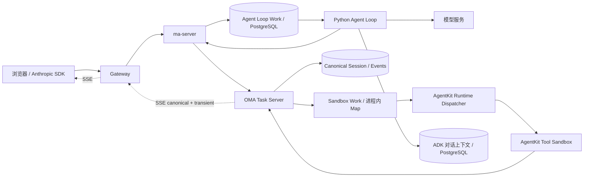
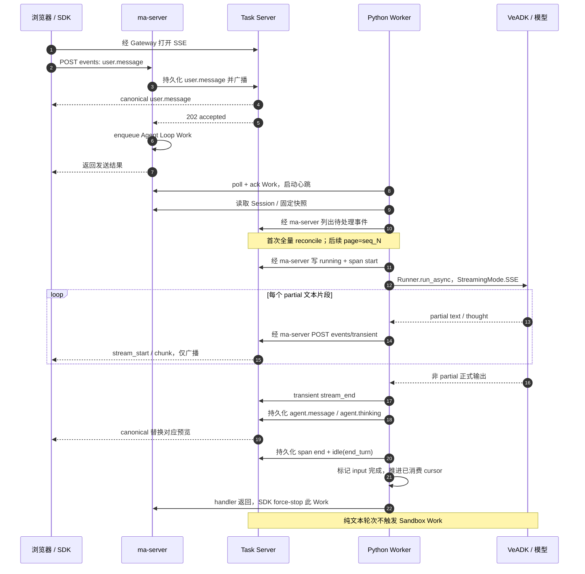
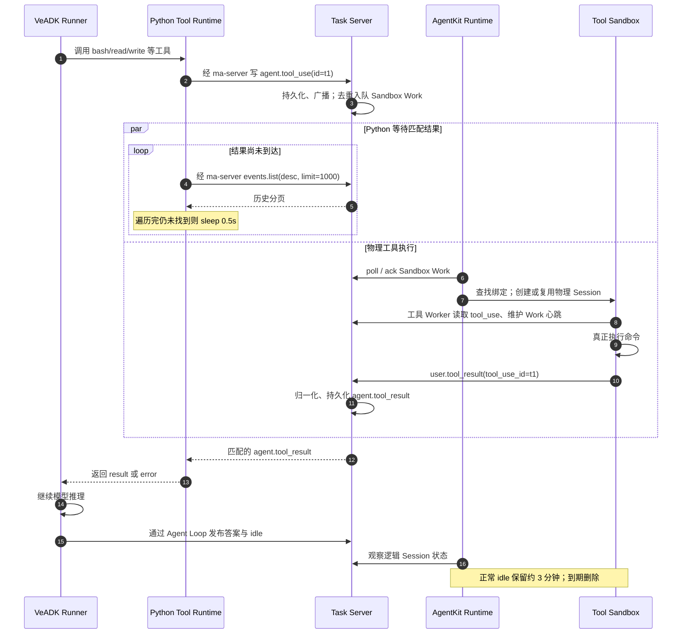
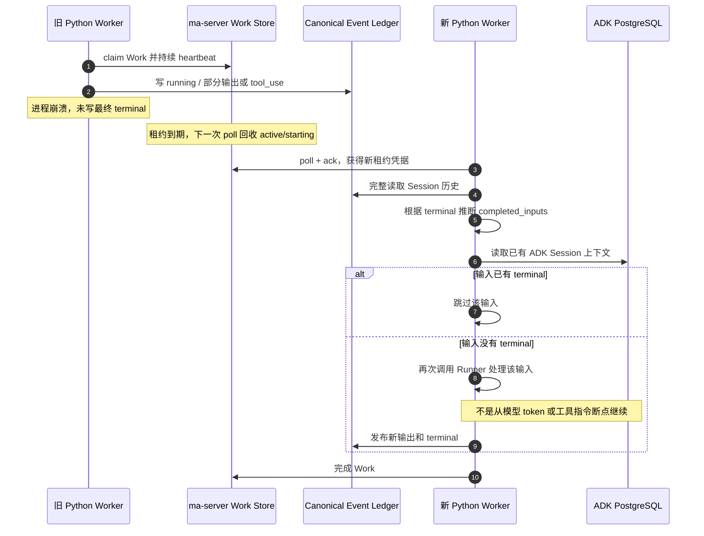
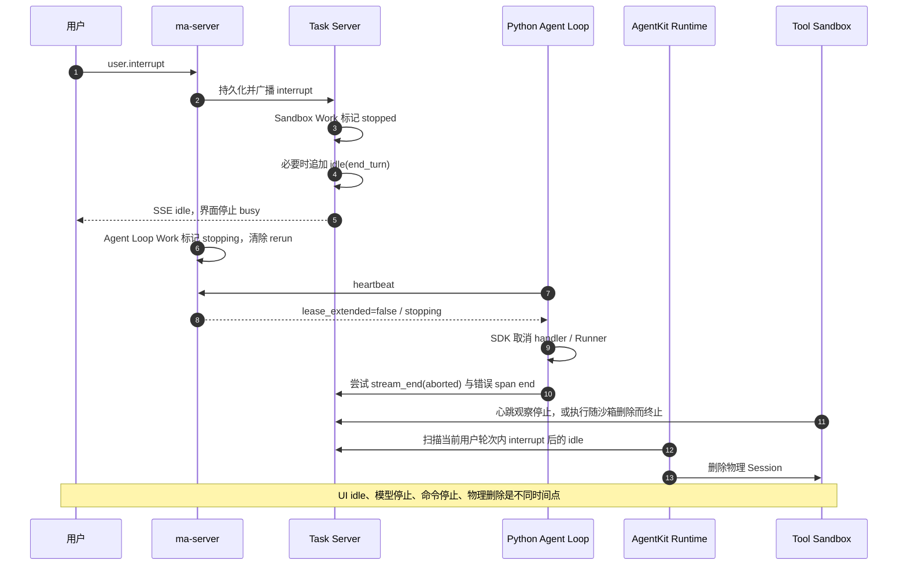

# Managed Agents 修改分析：Event 流转、故障恢复与效率

分析日期：2026-09-12。分析对象：`feat/managed-agents-agent-loop` 当前工作区，相对 `70d1536c` 的未提交修改，以及完成调用链所必需的相邻仓库实现。

**结论：这次修改把模型推理、工具执行和流式展示分开了，按需启动沙箱、增量读取事件和异步并发都有实际价值；但目前还不能称为可靠的断点续跑系统，也不能只凭 40 并发验收就认定整体效率高。** 主要缺口是工具 Work 队列仍在内存中、事件落库与任务入队不原子、跨 Worker 完成态同步不完整，以及 SSE 回放和服务端历史查询的规模问题。

本文区分三类证据：**源码确认**、**本次本地验证**、**既有线上记录**。本次只生成分析文档、运行本地验证和读取已有记录，没有修改业务代码或重新进行线上部署/压测。相邻仓库工作区可能包含未提交修改，下面的 HEAD 只是定位基准，不代表已部署镜像内容。

| 仓库 | 本次读取的 HEAD | 主要职责 |
| --- | --- | --- |
| 当前 VeADK 仓库 | `70d1536c` | Python Agent Loop、远程工具等待、前端、部署配置 |
| `agent-ma/ma-server` | `a4a3479` | Session 入口、Agent Loop Work、事件代理 |
| `gitcode/oma-test` | `68cc7fd` | Task Server、持久化事件、SSE、工具 Work |
| `gitcode/actb-mono` | `dea31fd` | AgentKit Runtime Dispatcher、物理沙箱生命周期 |
| `agent-ma/anthropic-sdk-python` | `34986b8f` | Work poll/ack、并发 dispatcher、租约心跳 |

## 1. 先分清四种对象和两条队列

| 对象 | 含义 | 生存周期 / 关联方式 |
| --- | --- | --- |
| 逻辑 `session_id` | 用户的一段持续对话 | 跨多轮、跨 Worker、跨物理沙箱保留 |
| `event.id` 与 `seq` | 一条事件的身份，以及该 Session 内的顺序 | canonical 事件持久化；`seq` 用于增量读取和回放 |
| `work_id` | 一次调度/租约对象 | 不等于一条 event；可能代表一个待处理轮次，也可能服务多个工具调用 |
| AgentKit physical Session ID | 真正承载工具进程的沙箱 | `UserSessionId` 绑定逻辑 Session；空闲回收后可换 ID |

特别要注意：**Agent Loop Work 和 Sandbox Work 是两个独立队列，只是 API 都叫 Environment Work。**

| 队列 | 服务端 | 谁消费 | 主要触发事件 | 当前持久性 |
| --- | --- | --- | --- | --- |
| Agent Loop Work | ma-server | Python 常驻 Worker | `user.message`；确认和自定义工具结果也可能唤醒 | `environment_work` 表，当前配置使用 PostgreSQL |
| Sandbox Work | OMA Task Server | AgentKit Runtime Dispatcher / Tool Worker | `agent.tool_use` | **进程内 `Map`，重启会丢失** |

`user.message` 只需要唤醒模型执行；只有模型产生受远程工具分支管理的 `agent.tool_use`，才需要物理沙箱。因此纯文本轮次可以完全不创建 AgentKit Tool Session。MCP、自定义工具另有执行路径，不能把所有工具都画成远程 bash。



Gateway 的路由决定访问的是哪条队列：

- 浏览器控制接口走 `/api`；官方 SDK 的 `/v1/sessions` 创建请求也经过 ma-server，以固定 Agent/Environment 快照并记录 Session 索引。
- Session event 写入经过 ma-server，让它在代理落库之后处理唤醒/中断。
- 浏览器 `/v1/sessions/{id}/events/stream` 可以直接代理到 Task Server，关闭代理缓冲。
- 公网 `/v1/environments/{id}/work/...` 走 Task Server，服务物理工具执行；常驻 Python Worker 内网访问 ma-server 的同名接口。

## 2. Event 分为持久化事实和临时预览

| 类型 | 生产者 | 接收方 / 用途 | 能否依赖历史恢复 |
| --- | --- | --- | --- |
| `user.message` | 浏览器 / SDK | 唤醒 Agent Loop，成为模型输入 | 可以，但未完成输入可能重跑 |
| `session.status_running` | Agent Loop | 前端显示执行中，更新 Session 状态 | 可以 |
| `span.model_request_start/end` | Agent Loop | 标记执行范围和 token usage | 可以；当前一轮包住整个 Runner，未必对应一次 HTTP 模型请求 |
| `agent.message` / `agent.thinking` | Agent Loop | 正式输出和展示内容 | 可以 |
| `agent.tool_use` | Python 工具 runtime | 记录参数，触发 Sandbox Work | 事件可以，Work 队列本身不可以 |
| `user.tool_result` → `agent.tool_result` | Tool Worker → Task Server 归一化 | 用 `tool_use_id` 匹配调用，解除 Python 等待 | 正式 result 可以 |
| `session.status_idle(end_turn)` | Agent Loop；中断路径也可由 Task Server 写入 | 当前输入结束，前端退出 busy | 可以；不等于物理进程已经退出 |
| `session.status_idle(requires_action)` | 工具 runtime | 等待确认或外部自定义工具结果 | 可以；**不能算输入完成** |
| `session.error` | Agent Loop 等 | 显示失败；Python 恢复逻辑把它算作 terminal | 可以；通常不会自动重试该输入 |
| `user.interrupt` | 浏览器 / SDK | 停止两条执行链，触发物理回收 | 可以；停止不能撤销已发生的工具副作用 |
| `agent.*_stream_start` / `*_chunk` / `*_stream_end` | Agent Loop | 实时文字/思考预览 | **不可以，仅广播、不进 canonical ledger** |

正式输出用 `message_id` / `thinking_id` 关联之前的预览；工具用 `tool_use_id` 关联调用与结果；span end 用 `model_request_start_id` 关联 start。**终态目前没有显式关联 `user.message.id`，完成态恢复依赖事件顺序推断，这是后文多个问题的根源。**

## 3. 正常流转时序

### 3.1 纯文本轮次与流式展示



这里的 streaming 不意味着每个 token 都写数据库。`partial=True` 的输出通过 `_publish_transient()` 发送到专用接口，失败记录 warning，原则上不让预览失败直接中断正式答案发布。正式事件仍走 `events.send()`。

但每个 transient HTTP 请求都是 `await`，且异常前可能经历 SDK 超时/重试。因此它是“失败后可继续”的 best effort，**并不是与模型消费速度解耦的后台发送队列**。

浏览器使用 `include=chunks` 读取 OMA 扩展事件。官方 SDK 请求 `event_deltas=agent.message` 时，Task Server 转换为 `event_start` / `event_delta`。当前适配层对 message 有内容 delta 映射；thinking 仅有 start 映射，不能据此宣称两者具有完全相同的官方 delta 支持。

### 3.2 远程工具轮次



Python 同时接受 `user.tool_result` 和 `agent.tool_result`，兼容不同服务端：收到前者会补发 canonical result；当前 OMA 自己归一化后，Python 通常直接收到后者。`_publish_runner_event()` 跳过 ADK function-call 记录，避免工具 runtime 与 Runner 重复发布 tool use。

确认策略为 `always_ask` 时，会先发布 `agent.tool_use(evaluated_permission=ask)` 与 `idle(requires_action)`，等待 `user.tool_confirmation` 再恢复 running。当前 Task Server 的入队条件只检查 `agent.tool_use` 类型，因此**沙箱可能在确认之前启动**；是否执行必须由工具 Worker 的权限逻辑控制。

本地模式在 Python 中执行工具。MCP 分支也由 Python runtime 处理；自定义工具发布 `agent.custom_tool_use` 后等待外部结果。这些分支不应被误认为都受 `MANAGED_AGENT_TOOL_EXECUTION=remote` 控制。

## 4. 游标与跨轮次状态如何工作

常驻 Worker 的 `event_states[session_id]` 包含：

| 字段 | 用途 | 丢失后的处理 |
| --- | --- | --- |
| `cursor_seq` | 最后实际检查过的 event seq | 重读历史 |
| `completed_inputs` | 已闭合或本进程已处理的 user event ID | 从终态重新推断 |
| `history_reconciled` | 是否完成过历史恢复 | 下次先 reconcile |
| `asyncio.Lock` | 同进程同 Session 串行消费 | 跨进程必须依靠服务端租约 |

`run_pending()` 的步骤是：拿锁 → 读取事件 → 必要时恢复完成态 → 执行未完成 `user.message` → 标记完成 → 推进 cursor → 释放锁。

首次调用使用 `events.list(limit=1000, order="asc")`；SDK 异步迭代器可以继续取后续页，1000 是页大小，不是“最多恢复 1000 条”。后续使用 `page="seq_N"`，Task Server 将其映射成 `after_seq=N`，只向客户端返回较新的事件。

若历史中同时有 `u1(seq=10)`、`u2(seq=11)`，而 `max_turns=1`，处理 u1 后 cursor 只推进到 10，不会直接推进到已读取列表末尾。下一次仍能看到 u2。**只读取过不等于已消费，这是此处正确的关键。**

cursor 异常处理：

1. 增量请求报错，或返回了 `seq <= cursor`，当次再完整读取历史，恢复完成集合，然后过滤旧 seq。
2. 已消费事件缺失 `seq/_seq`，把 cursor 清空，下一轮重新全量恢复。
3. 新 Pod、新进程或缓存被淘汰时重新恢复历史。
4. 不支持 cursor 的服务端没有被永久禁用：以后仍可能反复“增量失败 → 全量”，正确性保护不代表低成本。

缓存默认保留 4096 个 Session，按访问顺序近似 LRU。被锁住的状态不淘汰；全部被锁住时仍可新增，因此不是严格内存上限。每个 Session 的 `completed_inputs` 集合也会随输入数量增长。

另有 `run_claimed()` 常驻单 Session 模式，每约 1 秒 retrieve Session 并 `run_pending(max_turns=None)`，同时独立 heartbeat；idle 后继续等待。**当前 AgentKit 配套的 K8s Python Deployment 使用 `--managed-agent-worker`，走 SDK dispatcher，不是这个模式。** 旧 `run()` 是 SSE 消费模式，也不能与当前主路径的恢复语义混为一谈。

## 5. 故障如何恢复，以及恢复到哪一步

### 5.1 Python Worker 崩溃后的恢复



上述恢复需要 **Work 已成功进入 ma-server 持久队列、租约能被回收、数据库可访问、完成态推断正确**。ma-server 默认模型 Work 租约为 90 秒；过期工作在后续 `poll()` 中重新排队，所以故障恢复时间不等于心跳间隔。

ADK 对话上下文与 OMA event ledger 是两份不同用途的持久状态，没有看到跨二者的原子事务或从 OMA 完整重建 ADK 上下文的实现。`_ensure_local_session()` 只负责查找/创建 ADK Session。重跑时可能已有上一轮的部分 ADK 内容，需要单独验证重复 user input、工具调用和上下文一致性。

### 5.2 用户中断与物理回收



Runtime 会向后扫描当前轮次，识别“interrupt 之后已经出现 idle”，而不再要求它们恰好是最新两条；遇到更新的 `user.message` 会隔断旧中断。这样可以容忍取消后补发的工具结果、说明和 span end。当前观察窗口是最近 100 条事件，仍需留意极高事件量下的覆盖边界。

已发生的工具副作用不会因为中断自动回滚。即时 idle 也不是进程已停的证明；验收应分别观察命令是否继续产生输出、Worker 是否退出，以及物理 Session 是否删除。

### 5.3 按故障点列出的恢复能力

| 故障 | 当前行为 | 恢复边界 / 处理建议 |
| --- | --- | --- |
| 浏览器 SSE 断线 | 500/1000/2000 ms 重连；携带最后 canonical seq；失败后轮询 | 轮询默认间隔 1500 ms；只能恢复 canonical，不能补丢失 token 预览 |
| transient 发布失败 | warning 后继续处理 | 正式答案成功后可纠正预览；网络请求本身仍会拖慢 Runner |
| 模型普通异常 | 写错误 span end 与 `session.error` | `_run_turn()` 捕获后正常返回，输入被算作完成；并非自动重试 |
| Worker 被取消 | 尝试关闭 transient、结束错误 span，然后继续抛出取消 | `shield` 是尽力收尾；进程被 kill 或网络故障时并无持久化保证 |
| Worker 硬崩溃 | 已入队的模型 Work 等租约到期后可被接管 | 未闭合输入可能从头重跑；不是 exactly-once |
| 工具已执行，result 尚未落库时故障 | ledger 中可能只剩 tool_use | 重新执行可能重复副作用，需要工具幂等键/执行账本 |
| ma-server 在 event 写入后、enqueue 前崩溃 | 消息留在 Task Server，但没有对应 Work | 未见 outbox 或后台对账自动补队；仅重启 Worker 未必恢复 |
| Task Server 重启 | SQL Session/Event 保留，SSE 断开，内存 Sandbox Work 丢失 | 未见从未完成 tool_use 重建队列的启动流程；可能需要补队 |
| AgentKit Session 在活跃期间失效 | Runtime 观察到失败/消失后有限重建 | 不代表原工具进程或本地文件能恢复；Ready 也不证明内部 Worker 存活 |
| 正常 idle 超过约 3 分钟 | 删除物理沙箱 | 后续 tool_use 创建新沙箱，逻辑会话不变；临时文件/后台进程不保证保留 |
| PostgreSQL 不可访问 | event/context/work 操作均可能失败 | cursor fallback 不能修复数据库；还可能连 `session.error` 都写不进去 |

**交付语义应表述为：持久化历史支持回放和部分重试，整体仍可能重复执行或遗漏唤醒；当前没有端到端 exactly-once 保证。**

## 6. 已确认的问题与重要边界

以下优先级是本次分析的建议；涉及相邻仓库的条目是整体链路问题，不表示全部由当前 VeADK diff 新引入。

### P1：Task Server 工具队列不持久，租约语义也不完整

`globalWorkQueue/globalWorkItems` 使用内存 Map；`task-server.yaml` 明确要求单副本、`Recreate`。Session/Event 迁移到 PostgreSQL **不代表工具调度已具备相同持久性**。

当前 OMA heartbeat 不校验 `expected_last_heartbeat`，甚至未知 work ID 也可能返回 `lease_extended=true`；poll 未实现与 ma-server 同等的过期租约重排。因此不能把模型 Work 的租约 fencing / 崩溃接管能力套到工具 Work 上。

建议将工具队列、claim、租约与停止状态持久化，校验 owner/generation，拒绝不存在的 Work，并以未完成 tool_use 对账补队。

### P1：事件落库与 Work 入队存在双写窗口

ma-server 先等待 Task Server `events.send()`，再写本地 Work；创建 Session 的 initial events 也有同类窗口。Task Server 也是先 append `agent.tool_use`，再更新内存队列。任一步之间崩溃，都可能留下“事实存在但没有消费者被唤醒”。

建议使用 durable outbox / 可重试投递；消费者和投递端都按稳定 event ID 幂等。跨服务不能仅靠把两个调用放进同一函数解决。

### P1：完成态恢复没有输入与终态的显式关联

`_restore_completed_inputs()` 用 FIFO：遇到 user message 入队，遇到 terminal 就弹出最早输入。它改善了“一次 terminal 把所有排队输入都当完成”的旧问题，但仍依赖每个输入恰好有一个正确终态。

本次最小复现：

```text
user.message(u1)
user.message(u2)
session.error          # 假设来自 u1
session.status_idle    # 假设也来自 u1 的补发/中断收尾

恢复结果：u1、u2 都被标为 completed。
```

另一个独立复现：Worker A 保留旧 cursor，Worker B 已完成新输入 u2；A 再接到 Work，增量页中同时存在 u2 和其 idle，但当前增量路径不执行 `_restore_completed_inputs()`，A 仍调用 Runner 执行 u2。**本地验证观察到 Runner 调用 1 次。** 正常租约避免同时执行，不能自动同步多个进程中先后保留的缓存。

建议终态携带 `input_event_id/turn_id`，持久化输入执行状态；增量页面也更新完成态。缓存应作为性能优化，不承担唯一正确性判断。

### P1：SSE 历史回放会截断，且存在订阅切换窗口

Node `streamEvents()` 在返回 iterator 之前先把完整历史放入缓冲，缓冲上限为 1024，超出时直接不入队。

**本次用实际 Router、替身存储和 hub 复现：输入 1100 条 canonical 历史，首次 SSE 回放只得到 1024 条，最后 seq=1024。** 缺失的历史不会因为连接保持正常而自动补回；当前前端 SSE 正常时不并行对账。

此外，查询历史之后才 attach 实时 hub，历史快照与订阅之间写入的事件可能遗漏。客户端有 cursor 并不能消除此窗口。建议先订阅再取有界快照、按 seq 合并去重；溢出应断线并明确要求补读，不能静默丢事件。

### P1：SDK 在并发槽位之前已经领取下一项 Work

`EnvironmentWorkDispatcher.run()` 从 `aiter_work()` 取得已经 poll/ack 的 Work，之后才 `await limiter.acquire()`。心跳在实际 handler 启动后才开始。

当 40 个 handler 都在运行时，第 41 项可以已经被领取但等待空位；若等待超过模型 Work 的约 90 秒租约，其他 Worker 可能重新领取它。建议先获得并发槽再 claim，或为已领取但排队的 Work 立即续租。已有恰好 40 路的测试没有覆盖 41+ 路饱和排队。

### P2：配置里的 2 秒心跳没有作用于当前常驻 Worker

`MANAGED_AGENT_HEARTBEAT_INTERVAL_SECONDS=2` 仅被 `ManagedAgentsLoop.run_claimed()` 读取。当前 K8s 启动 `--managed-agent-worker`，其 SDK `_heartbeat_loop()` 默认值是 30 秒，再按返回 TTL 调整。

本次实际导入本地 SDK，确认 `_HEARTBEAT_DEFAULT == 30.0`。这意味着不能从 YAML 的 2 推导“模型取消最长 2 秒”。既有 3.44 秒 interrupt-to-idle 也不构成此证明，因为 Task Server 可以先写 idle。镜像内 SDK wheel 是否另有修改需要另查，本次不把本地结论冒充线上配置审计。

### P2：前端官方 delta 适配会把相同内容的片段合并掉

官方 `event_delta` 转成本地 chunk 时没有保留唯一 id/时间；无 seq/id 时 `eventKey()` 用 type、message ID 和文本拼接。两个不同片段内容恰好相同，就会命中同一个 key。

**本次复现：`ha` + `ha` 得到预览 `ha`，而不是 `haha`。** 最终 canonical message 可以纠正文本；浏览器当前直接请求的 OMA chunk 自带 transient ID，不具有同一个 key 问题。建议为接收的无 ID delta 分配单调位置，勿以内容作为唯一身份。

思考块采用“按用户轮次聚合、streamed/canonical 分别累积、展示更长文本”，解决了重复标题；但“更长”仍是启发式，不等于严格以 canonical 为准的校对协议。

## 7. 效率到底高不高

### 7.1 已实现的收益

1. **纯文本不启动工具沙箱。** 降低启动等待和物理资源占用；这是架构上最直接的成本收益。
2. **同进程跨 Work 复用 cursor。** 不再每轮把已消费历史全部传给 Python；同 Session 串行、不同 Session 异步并发。
3. **transient 不落库。** 高频预览不会逐片增加 canonical event 行数，也减少重放数据。
4. **3 分钟 idle 宽限。** 连续工具轮次可复用沙箱；长空闲后释放计算资源。代价是宽限期资源占用，以及之后的冷启动。
5. **有界并发 40。** 对模型 HTTP 和工具等待这样的 I/O 负载有效；40 是 handler 上限，不是 CPU 倍数或稳定吞吐承诺。

### 7.2 不能把 Python cursor 的优化当作全链路线性复杂度

设 `H` 为 Session 历史事件数，`Δ` 为本次新增事件数，`P` 为页大小，`K` 为轮数。

| 路径 | 当前成本 / 现象 | 影响 |
| --- | --- | --- |
| Python 常驻 Worker 增量 list | 返回给 Python 的数据约 `O(Δ)`；首次需要 `O(H)` | 对稳定 Worker 的多轮会话有效 |
| Task Server canonical append | `appendAsync()` 后 `getEventsAsync()` 全量读取，再取最后一条广播 | 每写一条仍可能 `O(H)`；长会话累计可呈二次增长 |
| Task Server 普通 getEvents | SQL 仅应用 afterSeq，limit/before/order 在 JS 内处理 | 不是完整的数据库侧分页 |
| 升序多页冷恢复 | 第 1 页读 H，后续页读 H-P、H-2P… | DB 读取总量约 `O(H²/P + H)`，尽管客户端只收到 H 条 |
| 降序历史等待 | 每页都先读完整 H，再 reverse/filter/slice | 没找到 result 时，扫描全部页约 `O(H·ceil(H/P))` DB 行读取 |
| 工具结果等待 | 每次全历史扫描完再 sleep 0.5 秒 | 并发长工具会持续压服务端和数据库 |
| 每个 transient chunk | 顺序 await 一个 HTTP POST，经过 ma-server 再到 Task Server | 减少 DB 写，但增加 RPC、代理和线程池负担 |
| 前端每次 event 更新 | 重建全量 Map、排序、重算状态，再遍历生成会话条目 | 保留 N 个事件时单次最坏约 `O(N log N)`；逐片累计成本高 |
| ma-server Work 写操作 | PostgreSQL 显式表锁 `SHARE ROW EXCLUSIVE` | claim/heartbeat/stop 等写入被串行化，扩容会遇到瓶颈 |
| AgentKit 状态观察 | 每个沙箱约 2 秒查询逻辑事件与物理状态 | 40 路理论上约 20 次/秒各类查询，实际受限流和网络耗时影响 |

具体例子：40 个工具都在等待结果，每个 Session 历史 1000 条，扫描延迟较小时，按每秒约 2 次扫描估计，是 **80 次完整 list 扫描/秒、约 8 万条事件/秒返回量**，还没有算 ma-server 到 Task Server 的中转、工具 Worker 自己的订阅和 Runtime 状态轮询。历史超过一页，Task Server 的数据库读放大会更明显。这里是按代码参数推算，不是实测 QPS。

理想的 Worker 侧收益可以描述为：从多轮反复传输累计历史，趋向于“首次 H + 后续各轮 Δ”；**当前整个系统尚未达到这个复杂度**，因为服务端 append、分页和远程工具等待仍在读取历史。

### 7.3 既有线上数据能证明什么

本次读取了既有 `0.0.23` 验收 JSON，而非只引用文字总结。文件位于 `/tmp/managed-agents-goal-20260912/`，它们是历史测试证据，不代表当前线上仍为同一版本。

| 场景 | 既有观测值 | 可以得出的结论 |
| --- | --- | --- |
| 最终 smoke 纯文本 | 首 delta 5.152 s，canonical message 5.418 s，整轮 5.470 s | 流式早于完整答案，但此样本只提前约 0.27 s |
| 最终 smoke 工具轮 | 首最终答案 delta 8.081 s，canonical 8.292 s，整轮 8.327 s | 工具调用与继续推理可完成；首 delta 包含前序工具等待 |
| 40 并发长 bash | 40 个物理 Session，最大工具重叠数 40；全部同时执行 68.874 s | 是真实同时执行，超出了“仅提交 40 个请求”的证据强度 |
| 40 路工具时长 | 90.002–90.030 s；整批 124.348 s | 90 秒 sleep 场景有并发能力；不能推导真实 CPU 密集工作吞吐 |
| 40 路首答案 delta | 最小 99.954 s，中位 116.182 s，最大 122.630 s | 这些值包含长工具等待，不应作为纯模型 TTFT |
| 中断 | interrupt-to-idle 3.437 s；验收记录物理清理在 60 s 窗口内完成 | 证明该次逻辑中断和清理成功，不是取消延迟上界 |
| idle 回收后续聊 | 300 s 后同逻辑 Session 在不同 physical ID 完成第二轮 | 证明可重新创建并续聊，未证明任意文件/进程恢复 |

证据文件：`anthropic-smoke-agentkit-0023.json`、`anthropic-concurrency-40-agentkit-0023.json`、`anthropic-interrupt-agentkit-0023.json`、`anthropic-lifecycle-agentkit-0023.json`。背景见 [已有生命周期验收记录](AGENTKIT_STREAMING_LIFECYCLE_E2E.md)。

缺少同负载改前/改后对照、长历史阶梯测试、持续负载、CPU/内存/连接池/DB 读取量、部署副本扩展与故障注入数据，因此无法给出“提速 X%”或“已达到生产高可用”的结论。

**综合评价：资源使用方向合理，短会话与 I/O 并发能力已有证据；长会话和高频事件处理效率一般，跨组件恢复可靠性需要先补齐。**

## 8. 建议的改进顺序与验收方式

| 顺序 | 改进 | 验收重点 |
| --- | --- | --- |
| 1 | 持久化工具 Work、租约 fencing、补队 outbox | 在 event 已落库但未入队时 kill 服务；重启后输入/工具不会永久悬挂；旧 owner 被拒绝 |
| 2 | `turn_id/input_event_id`、持久完成态、增量同步、工具幂等 | 同 Session 在 A/B/A Worker 轮换；中断叠加排队消息；工具副作用后、result 前 kill |
| 3 | 修复 SSE 回放、订阅窗口、溢出策略 | 1100/10000 条完整回放；快照与订阅间插入事件；慢客户端不静默漏 canonical |
| 4 | 先拿并发槽再 claim；统一心跳配置 | 41/80 路请求，handler 阻塞超过 90 秒；测“真实 Runner 取消”而非仅 idle |
| 5 | SQL 下推 after/before/order/limit，append 返回已插入行 | 1k/10k/100k 历史下 list/append 读取量有界，无全历史回读 |
| 6 | 工具 result 按 ID 查询或 SSE 通知 + cursor 对账 | 长工具等待成本不随历史大小线性放大；断流能补读 |
| 7 | chunk 有界合并/发送队列，前端增量 reducer 与历史裁剪 | 在 chunk 高频、网络慢的情况下首字延迟稳定；canonical 优先可靠送达 |
| 8 | 运行观测与恢复告警 | 统计 pending age、claim wait、lease lost、cursor fallback、重复执行、每轮读写数、SSE gap |

这些是建议实施项，本次没有修改它们。

## 9. 本次验证与源码索引

### 已执行验证

- Python：`test_managed_agent_loop.py`、`test_self_host_sandbox_agent.py`、`test_self_host_sandbox_client.py`，**44 passed**；4 个既有 `BaseAgentConfig` 弃用警告。
- 前端：Client、Events、EventReducer、Ui、GatewayConfig 五组，**25 passed**。
- 本地最小探针：FIFO 重复终态误闭合下一输入、旧缓存增量页重复执行、官方同文本 delta 被去重、1100 条 SSE 历史截断到 1024 条，均已观察到上述行为。探针使用真实待分析函数及替身依赖，没有访问线上。
- 读取历史 JSON，复核 smoke 时间、40 路重叠时长、中断与生命周期结果。

现有 cursor 单测中“1005 条历史”使用的是替身异步迭代器，不是真实 HTTP 分页；跨 handler 测试是顺序调用，不代表验证了真实并发锁竞争。测试通过证明已有用例成立，不能替代这些缺失场景。

### 当前仓库

| 文件 | 重点入口 |
| --- | --- |
| [managed_agent_loop.py](managed_agent_loop.py) | `ManagedAgentEventState`、`run_pending`、`_list_pending_events`、`_restore_completed_inputs`、`_run_turn`、`_publish_runner_event` |
| [main.py](main.py) | `_wait_for_session_event`、`managed_work_tool_runtime`、`serve_managed_agent_worker`、`serve_claimed_managed_agent_work` |
| [nginx 配置](nginx.managed-agents.conf.template) | Session 创建、SSE、两种 Work 接口分流 |
| [Agent Loop 部署](k8s/managed-agents-deploy/agent-loop-agentkit.yaml) | `remote`、40 并发、180 秒 action timeout、启动模式 |
| [Task Server 部署](k8s/managed-agents/task-server.yaml) | 内存队列单副本说明、PostgreSQL 配置 |
| [前端 client](../../frontend/src/adk/managedAgents.ts) | `streamEvents`、`listEvents`、`interruptSession` |
| [前端 reducer](../../frontend/src/managed-agents/eventReducer.ts) | 预览合并、seq 去重、thinking 聚合、全量排序 |
| [前端页面](../../frontend/src/managed-agents/ManagedAgentsApp.tsx) | SSE 重连/轮询降级、busy 状态、interrupt |
| [Python 单测](../../tests/runtime/test_managed_agent_loop.py) | cursor、终态恢复、取消与流式映射 |

### 跨仓库实现（本机绝对路径）

| 文件 | 重点入口 |
| --- | --- |
| [ma-server api.py](/home/mofanke/github/agent-ma/ma-server/ma_server/api.py) | `append_events`：代理落库、enqueue、request stop；`publish_transient_events` |
| [ma-server Work Store](/home/mofanke/github/agent-ma/ma-server/ma_server/environment_work_store.py) | `enqueue/poll/heartbeat/stop`、租约、rerun、写锁 |
| [OMA Session 路由](/home/mofanke/gitcode/oma-test/packages/http-routes/src/sessions/index.ts) | `startsSelfHostedSandboxWork`、结果归一化、`openSse`、transient |
| [OMA Work 路由](/home/mofanke/gitcode/oma-test/packages/http-routes/src/environments/index.ts) | `globalWorkQueue/globalWorkItems`、poll/heartbeat |
| [NodeSessionRouter](/home/mofanke/gitcode/oma-test/apps/main-node/src/lib/node-session-router.ts) | `appendEvent/getEvents/streamEvents/publishTransient` |
| [SqlEventLog](/home/mofanke/gitcode/oma-test/packages/event-log/src/sql/index.ts) | `appendAsync/getEventsAsync`、seq 与 SQL 读取 |
| [SDK dispatcher](/home/mofanke/github/agent-ma/anthropic-sdk-python/src/anthropic/lib/environments/_dispatcher.py) | 并发槽位、heartbeat 与 handler 生命周期 |
| [SDK heartbeat](/home/mofanke/github/agent-ma/anthropic-sdk-python/src/anthropic/lib/environments/_worker.py) | `_HEARTBEAT_DEFAULT`、`_heartbeat_loop`、租约丢失处理 |
| [Runtime Sandbox Provider](/home/mofanke/gitcode/actb-mono/sandboxes/self-host-sandbox/src/dispatcher/sandbox_provider.go) | 物理创建/重建、idle 回收、Session 观察 |
| [Runtime 状态识别](/home/mofanke/gitcode/actb-mono/sandboxes/self-host-sandbox/src/dispatcher/tae_runner.go) | `latestManagedSessionState` 中断事件窗口 |

