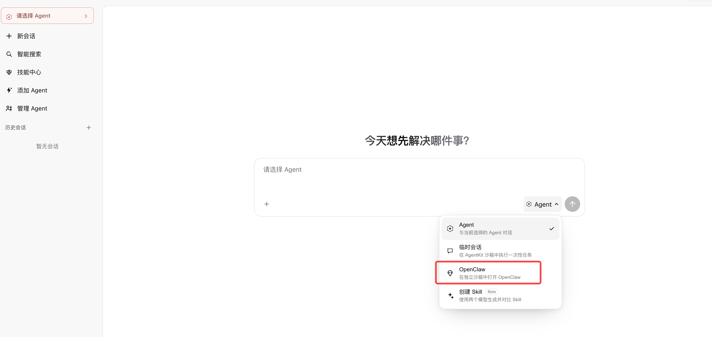

帮我实现一个feature ，在veadk studio 支持 chat页面创建出来openclaw 和hermes沙箱.
然后iframe嵌入返回的url的信息，支持展示session的生存时间，可以收起，再打开。

hermes 镜像
temp-cr-images-cn-beijing.cr.volces.com/aiosandbox/arkclaw-omni:hermes-202607171711

openclaw镜像
temp-cr-images-cn-beijing.cr.volces.com/aiosandbox/arkclaw-omni:202607240107
启动命令都是/opt/gem/run.sh，端口都是8080
需要的env 模仿codex 的实现，根据ak sk去获取

 "MODEL_AGENT_API_KEY": "ark-54",
  "MODEL_AGENT_NAME": "doubao-seed-evolving",
  "MODEL_AGENT_BASE_URL": "https://ark.cn-beijing.volces.com/api/v3"

然后可以利用本地的.env deploy大 云上，然后测试

用户名：zhangning
密码:Ss654321@

你先把本地的测试链路打通，先写个脚本

本地的veadk ，运行 uv run veadk studio 然后看看.env 启动，打开浏览器测试，我确认后，再去做需求，然后浏览器测试，一直到符合预期
veadk studio deploy \
  --user-pool-id ff006aba-13e0-47f0-b1e2-***122c1 \
  --allowed-client-id dfac85e3-2391-4e50-9041-3f1***13 \
  --vefaas-app-name my-veadk-studio

前端是npm run dev启动